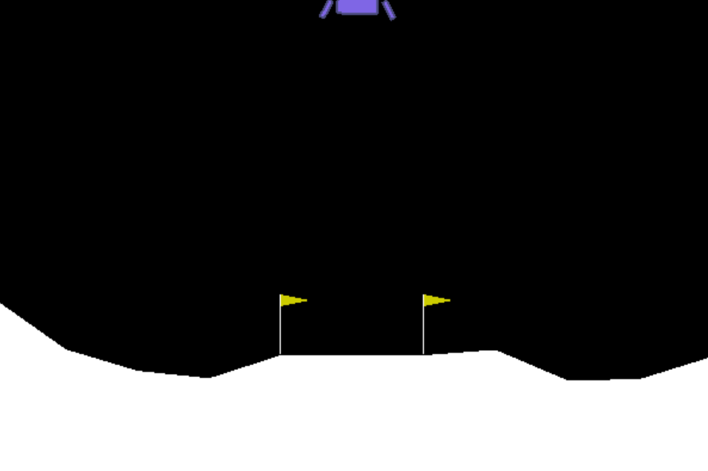

### Policy Gradient With Mean Rewards Baseline, Rewards-To-Go and Entropy Bonus

Base implementation of the policy gradient algorithm. This implementation uses `rewards-to-go` as the weight for the gradient.
Also, the model uses policy `entropy bonus` and state-specific `baseline`.

The model can be trained on 2 environments (CartPole and LunarLander) without any modifications. In order to use the model for other OpenAI environments the code has to be slightly modified.

#### Run

1. Create a conda environment from `reqs.yml` 
2. Run `python policy_gradient.py --env LunarLander` or `python policy_gradient.py --env CartPole`

#### Screenshots

